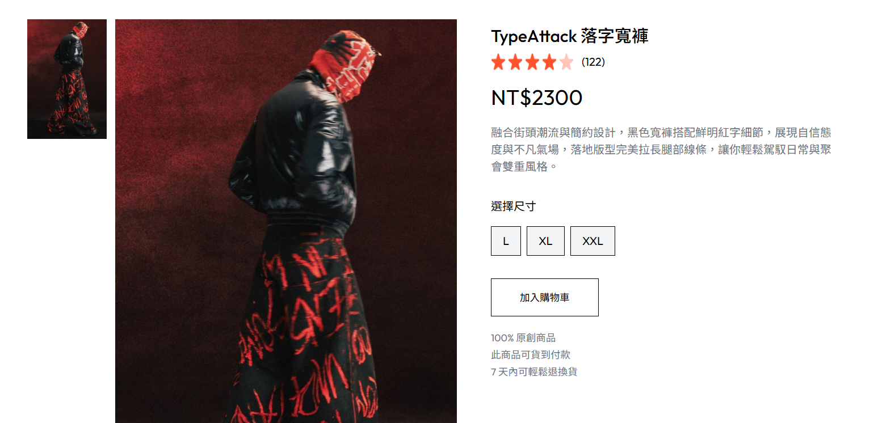
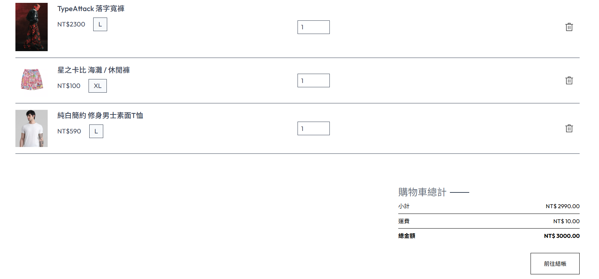
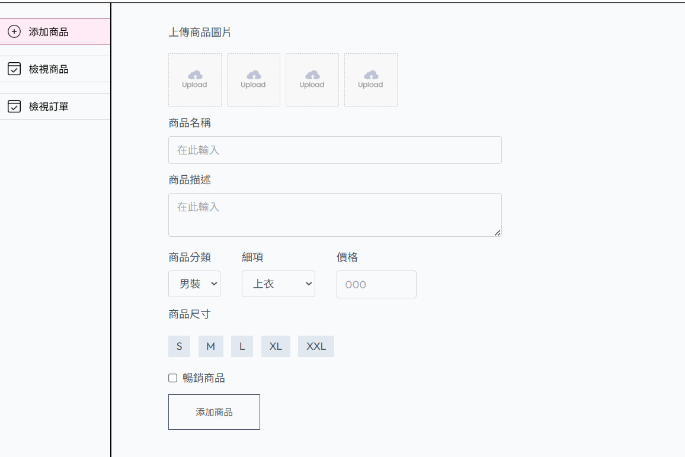

# 🛍️ Fiorvo — MERN 專案服飾購物網站

Fiorvo Fashion 是一個以 MERN 技術打造的時尚服飾購物網站，提供完整的購物流程與後台管理功能。支援前台商品瀏覽、購物車、結帳，並有專屬後台供管理員登入維護商品與訂單資料。  

**作者** : Felix Zheng


---

## 🚀 Tech Stack

- **前端**：React + Tailwind CSS + Vite
- **後端**：Node.js + Express
- **資料庫**：MongoDB
- **資源儲存** : Cloudinary
- **部署**：Vercel


---

## Live Demo

> 👉 Client 登入入口：[FIORVO](https://fiorvo-frontend.vercel.app/login)  
> 👉 Admin 後台入口：[FIORVO_Admin](https://fiorvo-admin.vercel.app/add)

| 帳號 | 密碼     |
|------|----------|
| `admin@gmail.com` | admin123 |

---

## ✨ 功能列表 Features

### 前台（使用者端）
- 註冊與登入
- 商品瀏覽與篩選
- 加入購物車
- 結帳流程
- 訂單紀錄查詢

### 後台（管理者端）
- 商品管理（新增 / 編輯 / 刪除）
- 訂單管理（狀態變更）
- 登入驗證機制

---

## 📷 網站畫面 Screenshots

### 首頁畫面 Home Page


### 商品頁 Products Page


### 購物車 Cart Page


### Admin 後台


---

## 🛠️ 安裝教學和前置作業 Installation

**安裝需求**  
Node.js (LTS)  
MongoDB Atlas 帳號與資料庫  
Cloudinary 帳號  


前端

```bash
cd frontend
npm install
npm run dev
```
後端
```bash
cd backend
npm install
npm run server
```
後台
```bash
cd admin
npm install
npm run dev
```
請於 `backend` 目錄下建立 `.env` 檔案，範例如下：

```env
PORT=4000
MONGODB_URI="mongodb+srv://<username>:<password>@cluster0.xxxxxx.mongodb.net"
CLOUDINARY_API_KEY="your_cloudinary_api_key"
CLOUDINARY_SECRET_KEY="your_cloudinary_secret"
CLOUDINARY_NAME="your_cloudinary_name"
JWT_SECRET="your_jwt_secret"
ADMIN_EMAIL="your_admin_email"
ADMIN_PASSWORD="your_admin_password"
```
請於 `frontend`和 `admin` 目錄下各建立一個 `.env` 檔案，範例如下：
```env
VITE_BACKEND_URL=http://localhost:4000
```
---

## 🗃️ MongoDB Atlas 資料庫設定

1. 前往 [MongoDB Atlas](https://www.mongodb.com/cloud/atlas) 註冊帳號。
2. 建立一個 Cluster 並新增一個 Database。
3. 建立一組 Database 使用者帳號與密碼。
4. 點選「Connect」>「Connect your application」，複製連線字串：
5. 將上方連線字串貼上至 `.env` 中的 `MONGODB_URI`，並替換 `<username>` 與 `<password>`。

---

## 🌩️ Cloudinary 圖片上傳設定

1. 前往 [Cloudinary](https://cloudinary.com/) 註冊帳號。
2. 登入後進入 Dashboard，可看到以下資訊：
- **Cloud name** → 對應 `.env` 裡的 `CLOUDINARY_NAME`
- **API Key** → 對應 `.env` 裡的 `CLOUDINARY_API_KEY`
- **API Secret** → 對應 `.env` 裡的 `CLOUDINARY_SECRET_KEY`
3. 將這些資訊複製並填入 `.env` 檔案中。

---

**學習資料** : [GreatStack](https://www.youtube.com/watch?v=7E6um7NGmeE)  
Thanks for [GreatStake](https://www.youtube.com/@GreatStackDev), helps me to build this awesome project!
